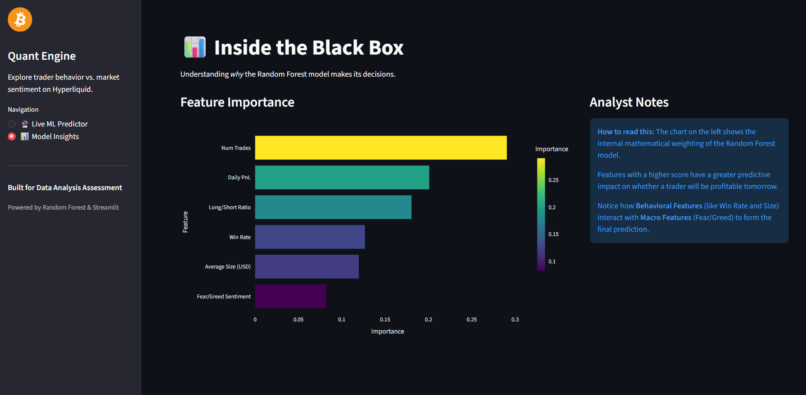
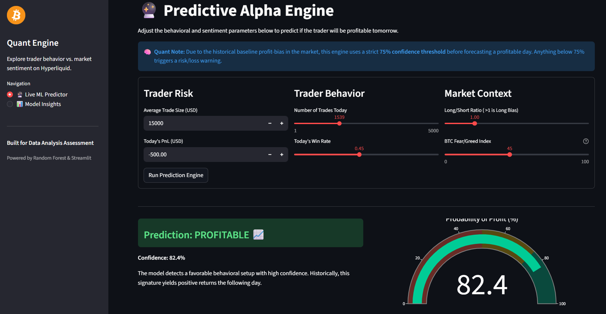
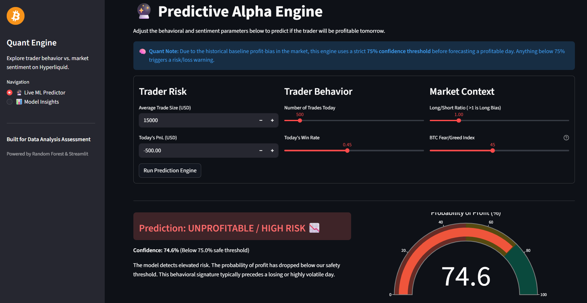

---

# 🚀 Hyperliquid Trading Profit Predictor

🔗 **Live App:** [https://ml-trading-profit-predictor-km9a4egk8k4cpwzdyuwrsr.streamlit.app/](https://ml-trading-profit-predictor-km9a4egk8k4cpwzdyuwrsr.streamlit.app/)

---

## 📌 Overview

This project builds a **data-driven trading intelligence system** that analyzes trader behavior and market sentiment to **predict next-day profitability**.

In modern crypto markets, traders often make decisions influenced by **emotion (fear/greed)** and **behavioral patterns (overtrading, leverage, bias)**.
This project answers a critical question:

> **Can we use trader behavior + market sentiment to predict trading success?**

### 🎯 Problem Statement

* Traders frequently **underperform due to emotional bias**
* Market sentiment (Fear vs Greed) affects decision-making
* No simple system exists to **combine behavior + sentiment into actionable insights**

### 💡 Solution

This project:

* Processes large-scale trading data (200k+ trades)
* Extracts behavioral features
* Combines them with market sentiment
* Builds a predictive ML model
* Deploys an interactive app for real-time insights

---

## ⚡ Key Features

### 🔹 Data Processing

* Cleans and aggregates **211K+ raw trades**
* Aligns trading activity with **daily sentiment data**

### 🔹 Feature Engineering

* `win_rate` → trader accuracy
* `long_short_ratio` → directional bias
* `num_trades` → overtrading behavior
* `avg_size_usd` → risk exposure
* `daily_pnl` → performance momentum

### 🔹 Machine Learning Model

* Predicts **next-day profitability**
* Handles class imbalance
* Prevents overfitting with controlled depth

### 🔹 Behavioral Clustering

* Segments traders into:

  * Aggressive
  * Conservative
  * Overtraders

### 🔹 Interactive Dashboard

* Built with **Streamlit**
* Allows real-time predictions
* Visualizes trader behavior and performance

---

## 🛠 Tech Stack

<p align="left">
  
  
  
  
  
  
  
</p>

### 🤖 Machine Learning

* Random Forest Classifier

  * Handles non-linearity
  * Robust to noise
  * Works well on tabular financial data

### 🌐 Deployment

* Streamlit → interactive web app
* Pickle (`.pkl`) → model serialization

---

## 📂 Project Structure

```
├── app.py                     # Streamlit dashboard
├── hyperliquid_rf_model.pkl  # Trained ML model
├── insights.png              # Insights visualization
├── Profitable.png            # Profit prediction example
├── Unprofitable.png          # Loss prediction example
├── Project_Document.pdf      # Full project report
├── README.md                 # Project documentation
├── requirements.txt          # Dependencies
└── LICENSE
```

### 🔍 File Explanation

* **app.py** → Runs the live prediction interface
* **model.pkl** → Saved trained model for fast inference
* **images** → Visual proof of insights and predictions
* **report** → Detailed explanation of methodology

---

## 🔄 How It Works (Pipeline)

```
Raw Trades (211K rows)
        ↓
Feature Engineering (behavior metrics)
        ↓
Merge with Sentiment Data
        ↓
Daily Account-Level Dataset
        ↓
ML Model (Random Forest)
        ↓
Prediction (Next-Day Profitability)
        ↓
Streamlit Dashboard Output
```

---

## 🤖 Model Details

### Algorithm Used

**Random Forest Classifier**

### Why Random Forest?

* Handles **non-linear patterns** in trading behavior
* Robust to noisy financial data
* Provides **feature importance insights**

---

### 📊 Evaluation Metrics

* Accuracy
* Precision / Recall
* F1 Score
* Confusion Matrix

---

### ⚠️ Challenges Addressed

| Challenge            | Solution                          |
| -------------------- | --------------------------------- |
| Class imbalance      | `class_weight='balanced'`         |
| Overfitting          | Limited tree depth                |
| Noisy financial data | Aggregation + feature engineering |
| Temporal leakage     | Proper shifting for target        |

---

## 📈 Results & Insights

### 🔥 Key Findings

* Traders perform **better during Fear periods**
* **Greed leads to larger losses (overconfidence)**
* High-frequency traders → **lower win rate**
* Strong **long bias during Fear ("buy the dip")**

---

### 🧠 Behavioral Insights

* Overtrading reduces profitability
* Larger position sizes increase risk
* Sentiment significantly impacts performance

---

## 🌐 Live Demo

👉 **Try it here:**
[https://ml-trading-profit-predictor-km9a4egk8k4cpwzdyuwrsr.streamlit.app/](https://ml-trading-profit-predictor-km9a4egk8k4cpwzdyuwrsr.streamlit.app/)

---

## ⚙️ Installation & Usage

### 1️⃣ Clone Repository

```bash
git clone https://github.com/your-username/your-repo-name.git
cd your-repo-name
```

### 2️⃣ Install Dependencies

```bash
pip install -r requirements.txt
```

### 3️⃣ Run App

```bash
streamlit run app.py
```

---

## 📸 Screenshots

*(Add these images in your repo for best impact)*

* Insights Visualization
* Profit Prediction Output
* Loss Prediction Output
* Dashboard UI
## 📊 Insights


## ✅ Profitable Scenario


## ❌ Unprofitable Scenario


---

## 🚀 Future Improvements

* Add **XGBoost / LightGBM** for higher accuracy
* Include **real-time market data API**
* Improve feature set (volatility, indicators)
* Deploy on cloud (AWS / GCP)
* Add user authentication & portfolio tracking

---

## 💡 Final Note

This project demonstrates how **data + behavioral finance + machine learning** can be combined to build **practical trading intelligence systems**.

It is designed to be:

* ✔ Scalable
* ✔ Interpretable
* ✔ Real-world applicable

---

## ⭐ If you found this useful

Give it a ⭐ and feel free to connect!

---
